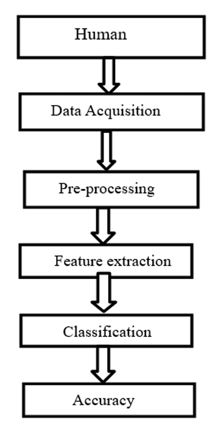
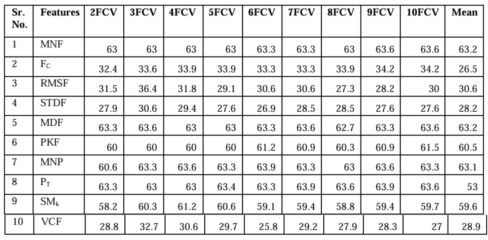
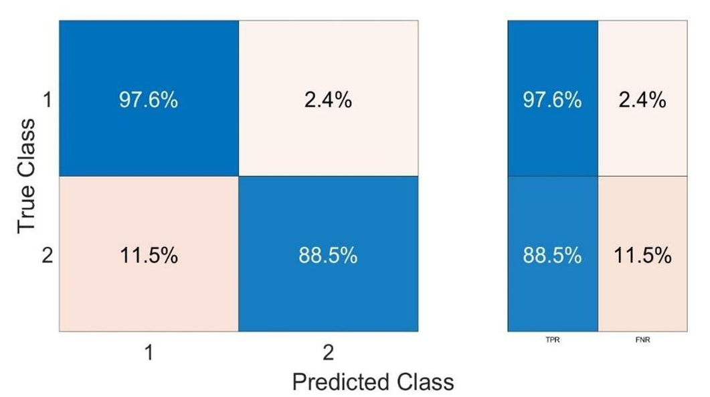
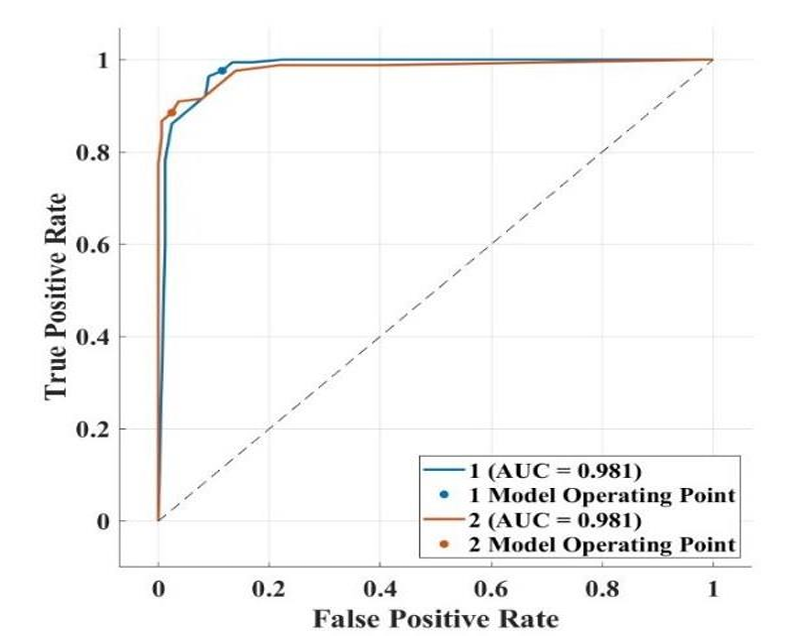

# Human Motor Imagery based EEG Signals Classification for BCI Systems

   

## 📌 Project Overview
**Author:** Shashank Kashyap    

Brain-Computer Interfaces (BCI) allow individuals suffering from paralysis to control external devices (like wheelchairs or robotic arms) using brain signals. This project focuses on **Motor Imagery (MI)**—the mental rehearsal of movement without physical output.

By analyzing **Electroencephalography (EEG)** signals from 10 subjects, this study develops a machine learning pipeline to classify whether a user is imagining **Left Hand** or **Right Hand** movement. The goal is to identify the most efficient algorithm to translate these thoughts into control commands.

---

## 🛠️ Methodology & Workflow
The study utilizes a 64-channel g.tec electrode system to capture raw brain signals, followed by a rigorous signal processing pipeline:

1.  **Data Acquisition:** 64-channel EEG data collected from 10 healthy subjects (3200 total imagination trials).
2.  **Pre-processing:** Noise reduction and signal normalization.
3.  **Feature Extraction:** Calculation of 14 Frequency-Domain (FD) features, including:
    *   Mean Frequency (MNF)
    *   Peak Frequency (PKF)
    *   Spectral Moments (SM1-SM5)
4.  **Classification:** Comparison of three K-Nearest Neighbor (KNN) variants:
    *   Cosine KNN
    *   Coarse KNN
    *   **Cubic KNN** (Best Performer)

 
<em>Figure 1: Block diagram of the EEG classification workflow.</em>

---

## 📊 Key Findings

### 1. Feature Performance
We evaluated 14 different frequency domain features. **Peak Frequency (PKF)** was identified as the most individual relevant feature, achieving the highest standalone accuracy compared to Mean Power or Median Frequency.

### 2. Algorithm Comparison
The **Cubic KNN** classifier outperformed Cosine and Coarse variants. It demonstrated robustness across 2-fold to 10-fold cross-validation methods.

 
<em>Table 1: Performance metrics of the Cubic KNN classifier across different validation folds.</em>

### 3. Classification Accuracy
The model achieved high precision in distinguishing between left and right-hand motor imagery.
*   **True Positive Rate (Class 1):** 97.6%
*   **True Positive Rate (Class 2):** 88.5%
*   **AUC (Area Under Curve):** 0.981

 
<em>Figure 2: Confusion Matrix showing high classification accuracy for Class 1 (Left Hand) and Class 2 (Right Hand).</em>

### 4. ROC Analysis
The Receiver Operating Characteristic (ROC) curve confirms the model's stability, with an Area Under the Curve (AUC) of **0.981**, indicating excellent separability between the two mental states.

 
<em>Figure 3: ROC Curve demonstrating the classifier's high sensitivity and specificity.</em>

---

## 💡 Conclusion
This project demonstrates that **Frequency Domain features**, specifically Peak Frequency, combined with a **Cubic KNN classifier**, provide a reliable method for interpreting Motor Imagery EEG signals. 

This approach offers a computationally efficient solution for BCI applications, potentially enabling real-time control of assistive devices for paralyzed patients.

---

## 🔒 Full Report Access
**This repository contains an overview of the analysis and key visualizations.** 

As this is a formal project report submitted for the award of Bachelor of Engineering, the full thesis document and code scripts are not publicly available in this repository.

**Recruiters & Academic Collaborators:**  
If you wish to review the full project report, detailed feature extraction formulas, or discuss the methodology, please contact me directly:

📧 **Email:** kashyapshashank222@gmail.com  
🔗 **LinkedIn:** https://www.linkedin.com/in/shashank-kashyap-805309238/

---

## 📚 References
*   **Dataset:** Private dataset (NITTTR Chandigarh), 64-channel g.tec system.
*   **Techniques:** FFT (Fast Fourier Transform), PSD (Power Spectral Density), KNN Classification.
